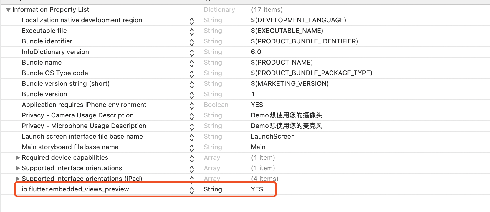

## 概述

互动直播Android SDK提供了一套简单易用的接口，允许开发者通过调用NELiveKit SDK(以下简称SDK)提供的API，快速地集成互动直播功能至现有Android应用中。

## 快速接入

### 开发环境

| 名称        | 要求         |
| :---------- | :----------- |
| iOS版本     | 9.0以上      |
| CPU架构支持 | ARM64、ARMV7 |
| IDE         | XCode        |
| 其他        | CocoaPods    |

### SDK集成

1. 新建iOS工程

    a. 运行XCode，选择Create a new Xcode project，选择Single View App，选择Next。
    

    b. 配置工程相关信息，选择Next。
    

    c. 然后选择合适的工程本地路径，选择Create完成工程创建。

2. 通过CocoaPods集成SDK

    进入到工程路径执行pod命令，生成Podfile文件，注意CocoaPods版本使用1.9.1以上的，防止因为版本过低导致无法拉取sdk。
    ```groovy
    pod init
    ```
    打开Podfile文件添加如下代码，保存。

    ```
    pod 'NELiveKit'
    ```

    执行pod命令，安装SDK

    ```
    pod install
    ```

3. 权限处理

    NELiveKit应用正常工作需要摄像头、麦克风权限，用户需要在工程中的Info.list文件中配置相关的权限信息

    

    以上权限需要在进入直播之前由用户根据需要进行权限申请，权限申请的代码如下：

    ```objective-c
    //相机权限申请
    [AVCaptureDevice requestAccessForMediaType:AVMediaTypeVideo 
     								         completionHandler:^(BOOL granted) {}];
    //麦克风权限申请
    [AVCaptureDevice requestAccessForMediaType:AVMediaTypeAudio 
                             completionHandler:^(BOOL granted) {}];
    ```

4. 渲染view注册。在info.plist文件中注册平台渲染视图，保证正常渲染。

    `io.flutter.embedded_views_preview     String       YES`

    

5. SDK初始化

    在使用SDK其他功能之前首先需要完成SDK初始化，初始化操作建议在**AppDelegate.m**的**application:didFinishLaunchingWithOptions:**方法执行。代码示例如下：
    ```objective-c
   
   
   
    ```

    **注意：其他操作一定更要等到初始化接口的回调返回之后再执行，否则会失败。**

6. 调用相关接口完成特定功能，详情请参考API文档。


## 业务开发

### 初始化

#### 描述

在使用SDK其他接口之前，首先需要完成初始化操作。

#### 业务流程


调用接口并进行回调处理，该接口无额外回调结果数据

    ```java
    });
    ```

--------------------

### 登录鉴权

#### 描述

请求SDK进行登录鉴权，只有完成SDK登录鉴权才允许创建直播间。SDK提供了多种登录方式可供选择，不同的登录接口需要不同的入参数。说明如下：

| 登录方式 | 说明 | 接口 | 参数 | 其他                              |
| :------ | :------ | :------ | :------ |:--------------------------------|
| Token登录 | 无 | `NELiveKit#login` | accountId、accountToken | 账号信息需要从互动直播服务器获取，由接入方自行实现相关业务逻辑 |


#### 业务流程

1. 获取登录用账号ID和Token。Token由网易互动直播应用服务器下发，但SDK不提供对应接口获取该信息，需要开发者自己实现。

    ```java
    ```

2. 登录并进行回调处理，该接口无额外回调结果数据

    ```java
    ```

#### 注意事项

- SDK不提供账号注册机制，第三方应用集成SDK时需要为第三方应用的用户帐号绑定互动直播系统中的帐号

--------------------

### 创建直播间

#### 描述

在已经完成SDK登录鉴权的状态下，创建并开始一个新的直播间。

#### 业务流程

调用创建直播接口并进行回调处理。

    ```java
    ```

2. 创建直播成功后，可以通过查询直播间列表查看该直播间,其他观众可通过直播号加入到该直播中来。

#### 注意事项

- 该接口仅支持**在登录鉴权成功后调用**，其他状态下调用不会成功

--------------------

### 停止直播间

#### 描述

在已经完成SDK登录鉴权的状态下，停止一个自己创建的直播间。

#### 业务流程

调用停止直播接口并进行回调处理。

    ```java
    ```

2. 停止直播成功后，其他观众不可以再通过直播号加入到该直播中来。

#### 注意事项

- 该接口仅支持**在登录鉴权成功后调用**，其他状态下调用不会成功

--------------------

### 加入直播间

#### 描述

在已登录的状态下，加入一个当前正在进行中的直播间。

#### 业务流程

调用加入直播间接口并进行回调处理。

    ```java
    ```

#### 注意事项

- 该接口仅支持登录和未登录状态调用
--------------------

### 离开直播间

#### 描述

在已登录的状态下，离开一个当前正在进行中的直播间。

#### 业务流程

调用离开直播间接口并进行回调处理。

    ```java
    ```

#### 注意事项

- 该接口仅支持登录和未登录状态调用
--------------------


### 邀请其他主播PK

#### 描述

在已开播的状态下，邀请其他主播进行PK。

#### 业务流程

调用邀请其他主播PK接口并进行回调处理。

    ```java
    ```

#### 注意事项

- 该接口仅支持登录和未登录状态调用
--------------------


### 取消邀请其他主播PK

#### 描述

在已开播的状态下，取消邀请其他主播进行PK。

#### 业务流程

调用取消邀请其他主播PK接口并进行回调处理。

    ```java
    ```

#### 注意事项

- 该接口仅支持登录和未登录状态调用
--------------------

### 接受其他主播的PK邀请

#### 描述

在已开播的状态下，接受其他主播的PK邀请。

#### 业务流程

调用接受其他主播的PK邀请接口并进行回调处理。

    ```java
    ```

#### 注意事项

- 该接口仅支持登录和未登录状态调用
--------------------

### 拒接其他主播的PK邀请

#### 描述

在已开播的状态下，拒绝其他主播的PK邀请。

#### 业务流程

调用拒接其他主播的PK邀请接口并进行回调处理。

    ```java
    ```

#### 注意事项

- 该接口仅支持登录和未登录状态调用
--------------------

### 给主播打赏礼物

#### 描述

在加入其他主播的直播间的状态下，给该主播进行打赏。

#### 业务流程

调用给主播打赏礼物接口并进行回调处理。

    ```java
    ```

#### 注意事项

- 该接口仅支持登录和未登录状态调用
--------------------

### 获取直播间成员列表

#### 描述

在加入其他主播的直播间或者自己开播的状态下，获取成员列表。

#### 业务流程

获取直播间成员列表。

    ```java
    ```

#### 注意事项

- 该接口仅支持直播间内调用
--------------------

### 查询当前直播间是否在PK

#### 描述

在加入其他主播的直播间或者自己开播的状态下，查询是否PK。

#### 业务流程

获取直播间PK状态。

    ```java
    ```

#### 注意事项

- 该接口仅支持直播间内调用
--------------------

### 查询直播间信息

#### 描述

在已登录状态下，查询一个直播间信息

#### 业务流程

1. 调用查询直播间信息接口并进行回调处理，可根据错误码判断是否成功

    ```java
    ```

#### 注意事项

- 该接口仅支持登录和未登录状态调用
--------------------

### 查询直播间列表

#### 描述

在已登录状态下，查询直播间列表

#### 业务流程

1. 调用查询直播间列表接口并进行回调处理，可根据错误码判断是否成功

    ```java
    ```

#### 注意事项

- 该接口仅支持登录和未登录状态调用

--------------------

### 直播间内的操作

#### 描述

在直播间内，可以做切换摄像头、开关音频、开关视频等操作

#### 业务流程

1. 调用查询直播间列表接口并进行回调处理，可根据错误码判断是否成功

    ```java
   //开启预览
   //切换摄像头
   //开关音频
   //开关视频
   //在自己的直播间静音PK的主播
   //绑定PK时，自己的画布
    ```

#### 注意事项

- 该接口仅支持登录和未登录状态调用

--------------------

### 监听直播间状态

#### 描述

通过注册直播间状态回调接口，可获取到直播间状态变更的通知。

#### 业务流程

1. 设置直播间监听器，并在回调方法中处理感兴趣的事件

    ```java
    ```

#### 注意事项

- 在SDK初始化成功后可以调用

--------------------

#### 注意事项

- 无

--------------------

### 注销

#### 描述

请求SDK注销当前已登录账号，返回未登录状态。

#### 业务流程

1. 调用接口并进行回调处理。该接口无额外回调结果数据，可根据错误码判断是否成功

    ```java
    ```

#### 注意事项

- 账号注销后，登录状态被清空，不再允许创建直播间

--------------------